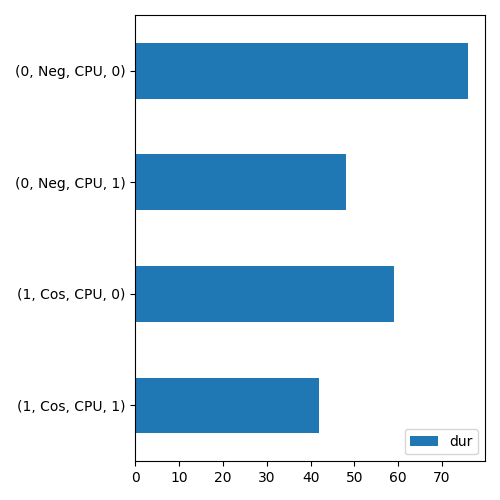

=============
command lines
=============

bench
=====

The function compares the execution of a random forest regressor
with different implementation of the tree implementations.
Example:

::

    python -m onnx_extended bench -r 3 -f 100 -d 12 -v -t 200 -b 10000 -n 100 \
        -e onnxruntime,CReferenceEvaluator,onnxruntime-customops

Output example::

    [bench_trees] 11:24:56.852193 create tree
    [bench_trees] 11:24:59.094062 create forest with 200 trees
    [bench_trees] 11:25:00.593993 modelsize 30961.328 Kb
    [bench_trees] 11:25:00.660829 create datasets
    [bench_trees] 11:25:00.724519 create engines
    [bench_trees] 11:25:00.724649 create engine 'onnxruntime'
    [bench_trees] 11:25:05.237548 create engine 'CReferenceEvaluator'
    [bench_trees] 11:25:08.616215 create engine 'onnxruntime-customops'
    [bench_trees] 11:25:21.837973 benchmark
    [bench_trees] 11:25:21.838058 test 'onnxruntime' warmup...
    [bench_trees] 11:25:21.997798 test 'onnxruntime' benchmark...
    [bench_trees] 11:25:28.298222 test 'onnxruntime' duration=0.06300305700002355
    [bench_trees] 11:25:28.298340 test 'CReferenceEvaluator' warmup...
    [bench_trees] 11:25:39.017608 test 'CReferenceEvaluator' benchmark...
    [bench_trees] 11:25:57.116259 test 'CReferenceEvaluator' duration=0.18098569900001166
    [bench_trees] 11:25:57.116340 test 'onnxruntime-customops' warmup...
    [bench_trees] 11:25:57.276264 test 'onnxruntime-customops' benchmark...
    [bench_trees] 11:26:03.638203 test 'onnxruntime-customops' duration=0.06361832300000969
    [bench_trees] 11:26:03.638315 test 'onnxruntime' warmup...
    [bench_trees] 11:26:03.793355 test 'onnxruntime' benchmark...
    [bench_trees] 11:26:10.111718 test 'onnxruntime' duration=0.0631821729999865
    [bench_trees] 11:26:10.111833 test 'CReferenceEvaluator' warmup...
    [bench_trees] 11:26:10.493677 test 'CReferenceEvaluator' benchmark...
    [bench_trees] 11:26:28.573696 test 'CReferenceEvaluator' duration=0.1807989760000055
    [bench_trees] 11:26:28.573834 test 'onnxruntime-customops' warmup...
    [bench_trees] 11:26:28.737896 test 'onnxruntime-customops' benchmark...
    [bench_trees] 11:26:35.095252 test 'onnxruntime-customops' duration=0.06357246399998985
    [bench_trees] 11:26:35.095367 test 'onnxruntime' warmup...
    [bench_trees] 11:26:35.238863 test 'onnxruntime' benchmark...
    [bench_trees] 11:26:41.230780 test 'onnxruntime' duration=0.05991804699999193
    [bench_trees] 11:26:41.230903 test 'CReferenceEvaluator' warmup...
    [bench_trees] 11:26:41.621822 test 'CReferenceEvaluator' benchmark...
    [bench_trees] 11:26:59.714731 test 'CReferenceEvaluator' duration=0.180928322999971
    [bench_trees] 11:26:59.714814 test 'onnxruntime-customops' warmup...
    [bench_trees] 11:26:59.871232 test 'onnxruntime-customops' benchmark...
    [bench_trees] 11:27:06.267876 test 'onnxruntime-customops' duration=0.06396529300000112
                        name  repeat  duration  n_estimators  number  n_features  max_depth  batch_size
    0            onnxruntime       0  0.063003           200     100         100         12       10000
    1    CReferenceEvaluator       0  0.180986           200     100         100         12       10000
    2  onnxruntime-customops       0  0.063618           200     100         100         12       10000
    3            onnxruntime       1  0.063182           200     100         100         12       10000
    4    CReferenceEvaluator       1  0.180799           200     100         100         12       10000
    5  onnxruntime-customops       1  0.063572           200     100         100         12       10000
    6            onnxruntime       2  0.059918           200     100         100         12       10000
    7    CReferenceEvaluator       2  0.180928           200     100         100         12       10000
    8  onnxruntime-customops       2  0.063965           200     100         100         12       10000

.. runpython::

    from onnx_extended._command_lines_parser import get_parser_bench
    get_parser_bench().print_help()

See function :func:`onnx_extended.validation.bench_trees.bench_trees`.

check
=====

The function checks the package is working after it was
installed. It shortly run a few functions to check shared libraries
can be used by the package.

.. runpython::

    from onnx_extended._command_lines_parser import get_parser_check
    get_parser_check().print_help()

See :func:`onnx_extended.check_installation`.

cvt
===

Conversion of a file into another format, usually a csv file
into an excel file.

.. runpython::

    from onnx_extended._command_lines_parser import get_parser_cvt
    get_parser_cvt().print_help()

display
=======

Displays information from the shape inference on the standard output
and in a csv file.

.. runpython::

    from onnx_extended._command_lines_parser import get_parser_display
    get_parser_display().print_help()

Output example::

    input       tensor      X           FLOAT       ?x?                                                         
    input       tensor      Y           FLOAT       5x6                                                         
    Op          Add                                             ,           FLOAT       X,Y         res         
    result      tensor      res         FLOAT       5x6                                                         
    Op          Cos                                             FLOAT       FLOAT       res         Z           
    result      tensor      Z           FLOAT       ?x?                                                         
    output      tensor      Z           FLOAT       ?x?   

.. autofunction:: onnx_extended._command_lines.display_intermediate_results

external
========

Split the model and the coefficients. The coefficients goes to an external file.

.. runpython::

    from onnx_extended._command_lines_parser import get_parser_external
    get_parser_external().print_help()

plot
====

Plots a graph like a profiling.

.. runpython::

    from onnx_extended._command_lines_parser import get_parser_plot
    get_parser_plot().print_help()

Output example::

    [plot_profile] load 'onnxruntime_profile__2023-11-02_10-07-44.json'
    args_node_index,args_op_name,args_provider,it==0,dur,ratio
    1,Cos,CPU,1,11,0.08396946564885496
    1,Cos,CPU,0,29,0.22137404580152673
    0,Neg,CPU,1,46,0.3511450381679389
    0,Neg,CPU,0,45,0.3435114503816794

    [plot_profile] save '/tmp/tmp40_jc95t/o.csv'
    [plot_profile] save '/tmp/tmp40_jc95t/o.png'

.. autofunction:: onnx_extended._command_lines.cmd_plot

print
=====

Prints a model or a tensor on the standard output.

.. runpython::

    from onnx_extended._command_lines_parser import get_parser_print
    get_parser_print().print_help()

Output example::

    Type: <class 'onnx.onnx_ml_pb2.ModelProto'>
    ir_version: 9
    opset_import {
      domain: ""
      version: 18
    }
    graph {
      node {
        input: "X"
        input: "Y"
        output: "res"
        op_type: "Add"
      }
      node {
        input: "res"
        output: "Z"
        op_type: "Cos"
      }
      name: "g"
      input {
        name: "X"
        type {
          tensor_type {
            elem_type: 1
            shape {
              dim {
              }
              dim {
              }
            }
          }
        }
      }
      input {
        name: "Y"
        type {
          tensor_type {
            elem_type: 1
            shape {
              dim {
                dim_value: 5
              }
              dim {
                dim_value: 6
              }
            }
          }
        }
      }
      output {
        name: "Z"
        type {
          tensor_type {
            elem_type: 1
            shape {
              dim {
              }
              dim {
              }
            }
          }
        }
      }
    }

.. autofunction:: onnx_extended._command_lines.print_proto

quantize
========

Prints a model or a tensor on the standard output.

.. runpython::

    from onnx_extended._command_lines_parser import get_parser_quantize
    get_parser_quantize().print_help()

Example::

    python3 -m onnx_extended quantize -i bertsquad-12.onnx -o bertsquad-12-fp8-1.onnx -v -v -k fp8 -q

Output example::

    INFO:onnx-extended:Model initial size: 143
    INFO:onnx-extended/transformer:[quantize_float8] upgrade model from opset 18 to 19
    INFO:onnx-extended/transformer:[quantize_float8] 2/4 quantize Node(2, <parent>, <MatMul>) [X,mat] -> [Z]
    INFO:onnx-extended:Model quantized size: 991

.. autofunction:: onnx_extended._command_lines.cmd_quantize

select
======

Extracts a subpart of an existing model.

.. runpython::

    from onnx_extended._command_lines_parser import get_parser_select
    get_parser_select().print_help()

Output example::

    INFO:onnx-extended:Initial model size: 101
    INFO:onnx-extended:[select_model_inputs_outputs] nodes 2 --> 1
    INFO:onnx-extended:[select_model_inputs_outputs] inputs: ['X', 'Y']
    INFO:onnx-extended:[select_model_inputs_outputs] inputs: ['res']
    INFO:onnx-extended:Selected model size: 102

.. autofunction:: onnx_extended._command_lines.cmd_select

stat
====

Produces statistics on initiliazers and tree ensemble in an onnx model.
See :func:`onnx_extended.tools.stats_nodes.enumerate_stats_nodes`

.. runpython::

    from onnx_extended._command_lines_parser import get_parser_stat
    get_parser_stat().print_help()

Output example::

    [cmd_stat] load model '/tmp/tmpxqeqawk1/m.onnx'
    [cmd_stat] object 0: name=('add', 'Y') size=4 dtype=float32
    [cmd_stat] prints out /tmp/tmpxqeqawk1/stat.scsv
       index joined_name  size   shape    dtype  min  max  mean  ...  hist_x_13  hist_x_14  hist_x_15  hist_x_16  hist_x_17  hist_x_18  hist_x_19  hist_x_20
    0      0       add|Y     4  (2, 2)  float32  2.0  5.0   3.5  ...       3.95        4.1       4.25        4.4       4.55        4.7       4.85        5.0

    [1 rows x 51 columns]

Output example with trees::

       index                                        joined_name       kind  n_trees  ...  n_rules            rules  hist_rules__BRANCH_LEQ  hist_rules__LEAF
    0      0  ONNX(RandomForestRegressor)|TreeEnsembleRegressor  Regressor        3  ...        2  BRANCH_LEQ,LEAF                       9                12

    [1 rows x 11 columns]

.. autofunction:: onnx_extended._command_lines.cmd_stat

store
=====

Stores intermediate outputs on disk.
See also :class:`CReferenceEvaluator <onnx_extended.reference.CReferenceEvaluator>`.

.. runpython::

    from onnx_extended._command_lines_parser import get_parser_store
    get_parser_store().print_help()

.. autofunction:: onnx_extended._command_lines.store_intermediate_results
