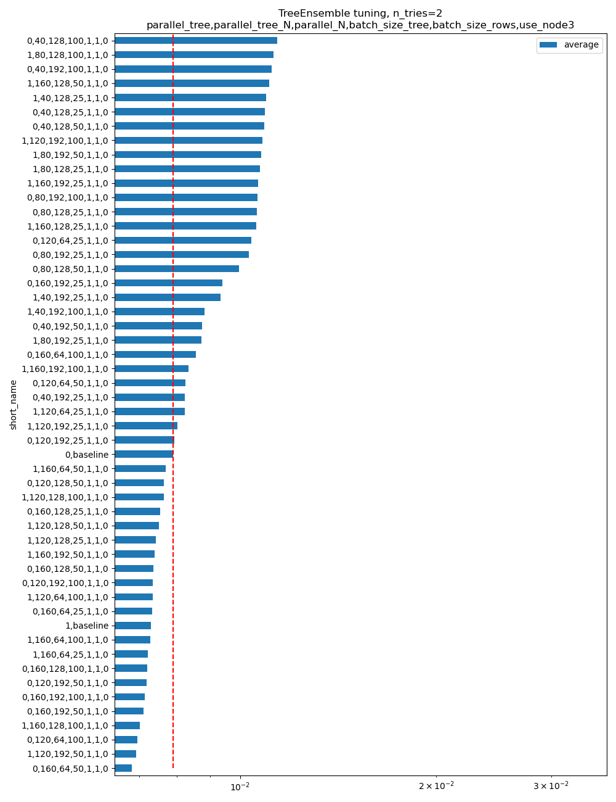

=====
Trees
=====

Parallelization implementation
==============================

There is no optimal way to parallelize on every machine and for every tree.
It depends on the tree size, the number of features,
the cache size, the number of cores.
The optimal parameters may be twice faster or twice slower, sometimes more,
than the fixed values currently uses in onnxruntime.

Six parameters
++++++++++++++

The latency of a tree ensemble depends on the tree size
and the machine it runs on. The following example
takes a model using a TreeEnsembleRegressor and replaces
it with a custom node and additional parameters to tune
the parallelization. The kernel is a custom operator
for :epkg:`onnxruntime`. There are six parameters.

The implementation in onnxruntime only uses the first three.
It takes place in method
`compute <https://github.com/microsoft/onnxruntime/blob/main/onnxruntime/core/providers/cpu/ml/tree_ensemble_common.h#L440>`_
in file `onnxruntime/core/providers/cpu/ml/tree_ensemble_common.h`.

This package uses the six parameters in an experimental implementation
to investigate new optimizations which could be brought to onnxruntime
if they prove to be significantly better. The code is in
`onnx_extended/cpp/include/cpu/c_op_tree_ensemble_common_.hpp
<https://github.com/sdpython/onnx-extended/blob/main/onnx_extended/cpp/include/cpu/c_op_tree_ensemble_common_.hpp#L640>`_.

The implementation distinguishes between batch inference and one-off inference.
The second one is usually uses in web services as the prediction always
happens one at a time. We denote *T* as the number of trees and
*N* the number of predictions to do. *N* is the batch size.

.. list-table::
    :widths: 1 2 2 2
    :header-rows: 1

    * -
      - name
      - default
      - range
    * - 0
      - parallel_tree
      - 40
      - [0, :math:`\infty` [
    * - 1
      - parallel_tree_N
      - 128
      - [0, :math:`\infty` [
    * - 2
      - parallel_N
      - 50
      - [0, :math:`\infty` [
    * - 3
      - batch_size_tree
      - 1
      - [1, :math:`\infty` [
    * - 4
      - batch_size_rows
      - 1
      - [1, :math:`\infty` [
    * - 5
      - use_node3
      - 0
      - {0, 1}

If `N==1` (one off prediction), the inference is parallelized by tree
if `T > parallel_tree`. Every chunk of `batch_size_tree` consecutive
trees is processed in parallel.

If `N > 1`, no parallelization is done if `N <= parallel_N_ && T <= parallel_tree_`.

If `T >= parallel_tree_`, the batch is split into chunks of
`parallel_tree_N` rows. In every chunk, the parallelization is done by tree:
every chunk of `batch_size_tree` consecutive
trees is processed in parallel.

Otherwise, the parallelisation is done by rows. The dataset is split into
chunks of `batch_size_rows` rows. Every of them is processed in parallel.

The last parameter is independant from the other. If enabled, the implementation
changes the structure to get bigger nodes equivalent to three node from the
original tree. This was originally intended to use AVX instructions
to speed up the implementation.

Change the parallelization settings
+++++++++++++++++++++++++++++++++++

Should we let the users define the parameters or let the
inference session take some time during the initalization to
find suitable parameters for the tree and the machine the model
is running on. The following example shows how to uses a custom
kernel to change the settings. It replaces the onnx nodes by another
one with the same parameters plus the parallelization settings.
The custom operator will be able to used them.

.. runpython::
    :showcode:

    import os
    import numpy as np
    from sklearn.datasets import make_regression
    from sklearn.ensemble import RandomForestRegressor
    from skl2onnx import to_onnx
    from onnxruntime import InferenceSession, SessionOptions
    from onnx_array_api.plotting.text_plot import onnx_simple_text_plot
    from onnx_extended.ortops.optim.cpu import get_ort_ext_libs
    from onnx_extended.ortops.optim.optimize import (
        change_onnx_operator_domain,
        get_node_attribute,
    )

    # The dimension of the problem.
    batch_size = 20
    n_features = 4
    n_trees = 2
    max_depth = 3

    # Let's create model.
    X, y = make_regression(batch_size * 2, n_features=n_features, n_targets=1)
    X, y = X.astype(np.float32), y.astype(np.float32)
    model = RandomForestRegressor(n_trees, max_depth=max_depth, n_jobs=-1)
    model.fit(X[:batch_size], y[:batch_size])
    onx = to_onnx(model, X[:1], target_opset=17)

    # onnx-extended implements custom kernels
    # to tune the parallelization parameters.
    # It requires to replace the onnx node by another
    # one including the optimization parameters.

    optim_params = {
        "parallel_tree": 80,
        "parallel_tree_N": 80,
        "parallel_N": 80,
        "batch_size_tree": 2,
        "batch_size_rows": 2,
        "use_node3": 0,
    }

    # Let's replace the node TreeEnsembleRegressor with a new one
    # and additional parameters.

    def transform_model(onx, op_name, **kwargs):
        att = get_node_attribute(onx.graph.node[0], "nodes_modes")
        modes = ",".join(map(lambda s: s.decode("ascii"), att.strings))
        return change_onnx_operator_domain(
            onx,
            op_type=op_name,
            op_domain="ai.onnx.ml",
            new_op_domain="onnx_extented.ortops.optim.cpu",
            nodes_modes=modes,
            **kwargs,
        )

    modified_onx = transform_model(onx, "TreeEnsembleRegressor", **optim_params)

    # The new attributes are added into the onnx file and defines
    # how the parallelisation must be done.
    print(onnx_simple_text_plot(modified_onx))

    # Let's check it is working.

    opts = SessionOptions()
    r = get_ort_ext_libs()
    opts.register_custom_ops_library(r[0])

    sess = InferenceSession(
        modified_onx.SerializeToString(),
        opts,
        providers=["CPUExecutionProvider"],
    )
    feeds = {"X": X}
    print(sess.run(None, feeds))

Optimizes the parallelisation settings
++++++++++++++++++++++++++++++++++++++

See example :ref:`l-plot-optim-tree-ensemble`.
It produces the following graph. The baseline means `onnxruntime==1.16.1`.
The command line is:

::

    python plot_optim_tree_ensemble.py --n_features=50 --n_trees=100 --max_depth=10 --scenario=CUSTOM
        --parallel_tree=160,120,80,40 --parallel_tree_N=192,128,64 --parallel_N=100,50,25
        --batch_size_tree=1 --batch_size_rows=1 --use_node3=0 

    